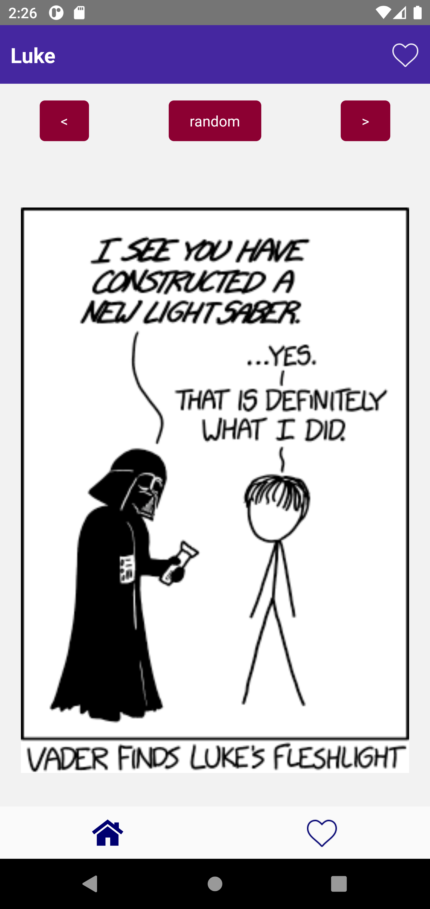
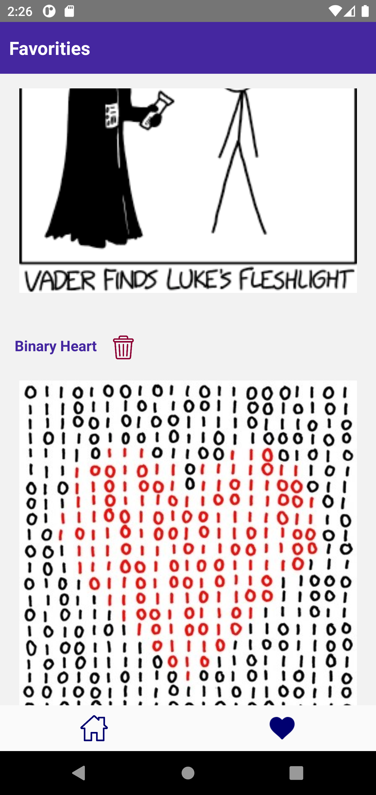

# Aplicación de comic xkcd

## Created by [npx react-native](https://reactnative.dev/docs/environment-setup)

## Style Guide
Use the [Airbnb React/JSX Style Guide](https://github.com/airbnb/javascript/blob/master/react/README.md)

# Requeriments
* node > 16.3.0
* npm > 8.4.0
* java > 7

# Setup
> ### git clone https://github.com/luish00/comic_xkcd

> ### `cd` comic_xkcd

> ### `yarn install`

> ### `yarn clean`

> ### `yarn start `

> ### `yarn android`

## the project directory, you can run:
Run react native server
> ### `yarn start`

Run android emulator
> ### `yarn android`

Clean java files
> ### `yarn clean`

Run eslit linter
> ### `yarn lint`

